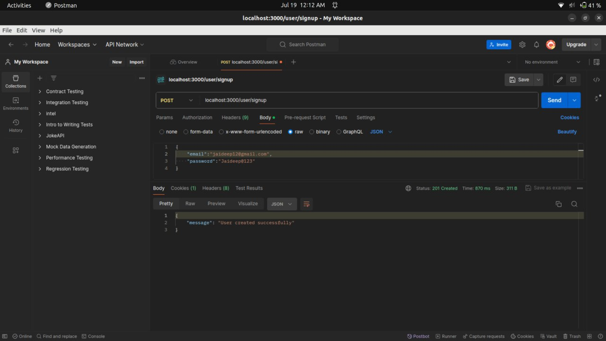
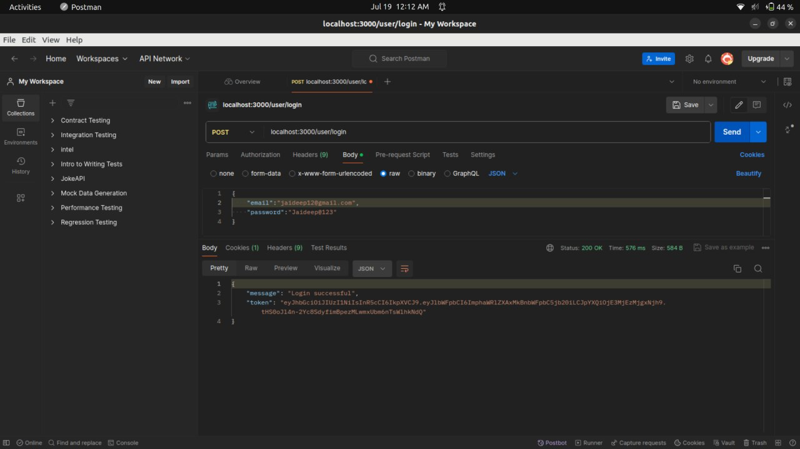
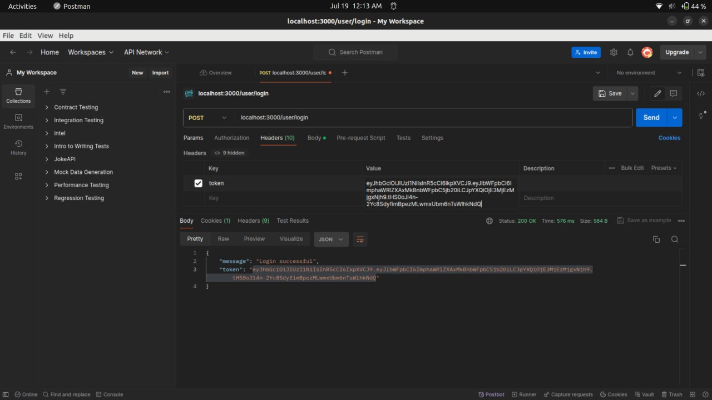
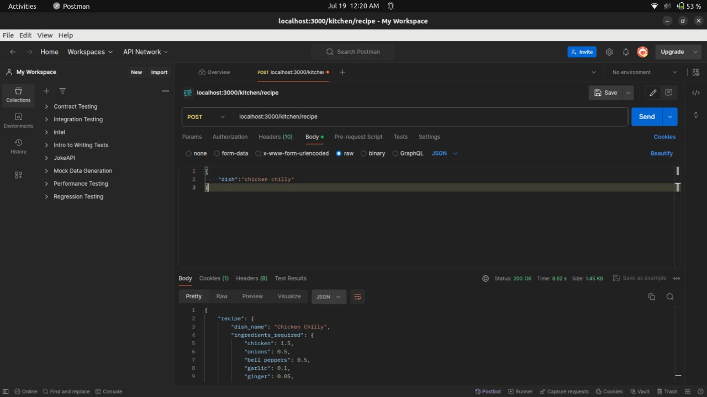
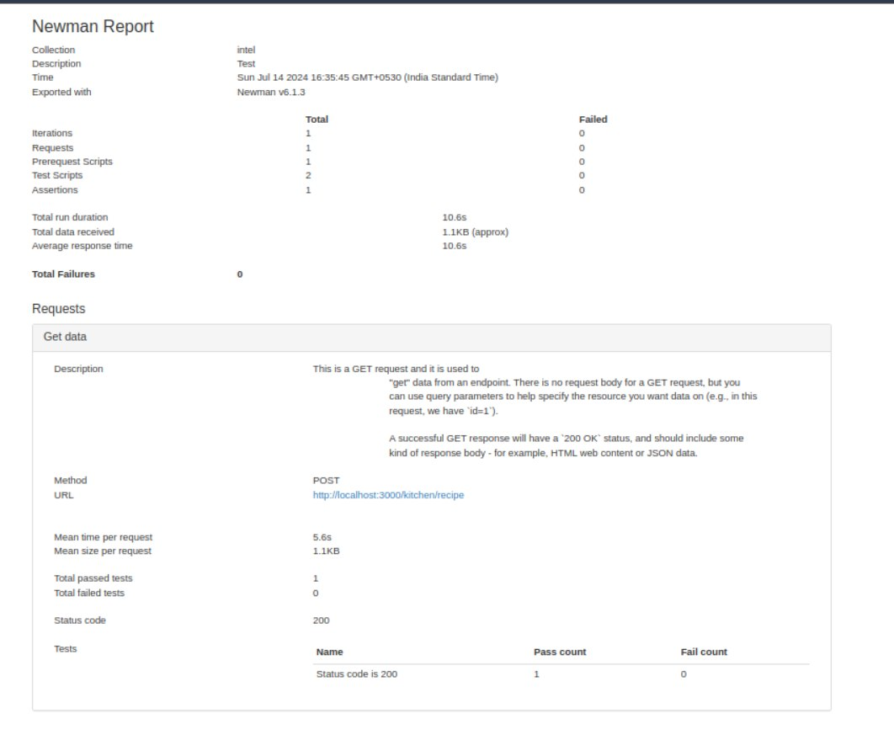

# Customized AI Kitchen for India

## Overview

Customized AI Kitchen for India is an intelligent cooking assistant designed to reduce the time and effort needed for meal preparation through AI-driven recipe suggestions. It integrates traditional kitchen appliances with advanced technologies to provide personalized and efficient cooking experiences.

## Features

- **Personalized Recipes:** Generates recipes based on user preferences and available ingredients using the OpenAI API.
- **Real-time Inventory Management:** Keeps kitchen inventory accurate and up-to-date.
- **Smart Utensil Selection:** Automates the detection and selection of clean utensils for cooking.
- **Notifications:** Alerts users when essential ingredients are missing and suggests alternatives or prompts restocking.
- **Seamless Integration:** Works seamlessly with traditional ovens for a wider range of cooking options.

## Tech Stack

- **Backend:** Node.js, Express.js
- **Database:** MongoDB Atlas, Mongoose ORM
- **Authentication:** bcrypt, JWT
- **Data Validation:** Zod
- **AI Integration:** OpenAI API
- **Real-time Updates:** WebSockets or similar technologies

## Setup Instructions

### Prerequisites

- Node.js
- npm (Node Package Manager)
- MongoDB Atlas account
- OpenAI API Key

### Installation

1. Clone the repository:
    ```sh
    git clone https://github.com/your-username/customized-ai-kitchen.git
    cd customized-ai-kitchen
    ```

2. Install the dependencies:
    ```sh
    npm install
    ```

3. Create a `.env` file in the root directory and add the following environment variables:
    ```
    PORT=3000
    OPENAI_API_KEY=your_openai_api_key
    MONGODB_URI=your_mongodb_uri
    JWT_SECRET=your_jwt_secret
    SALT_ROUNDS=10
    SESSION_SECRET=your_session_secret
    ```

4. Start the development server:
    ```sh
    npm run dev
    ```

### Testing with Postman

1. **User Signup**
    - URL: `http://localhost:3000/user/signup`
    - Method: POST
    - Body:
      ```json
      {
        "email": "user@example.com",
        "password": "your_password"
      }
      ```
    - The email will be verified by Zod.

2. **User Login**
    - URL: `http://localhost:3000/user/login`
    - Method: POST
    - Body:
      ```json
      {
        "email": "user@example.com",
        "password": "your_password"
      }
      ```
    - A JWT token will be returned.

3. **Request a Recipe**
    - URL: `http://localhost:3000/kitchen/recipe`
    - Method: POST
    - Headers:
      ```json
      {
        "Authorization": "Bearer your_jwt_token"
      }
      ```
    - Body:
      ```json
      {
        "dish": "Dish Name + Customisation"
      }
      ```
    - Sample response:
      ```json
      {
        "recipe": {
            "dish_name": "Chicken Chilly",
            "ingredients_required": {
                "chicken": 1.5,
                "onions": 0.5,
                "bell peppers": 0.5,
                "garlic": 0.1,
                "ginger": 0.05,
                "green chilies": 0.03,
                "soy sauce": 0.1,
                "cornstarch": 0.05,
                "oil": 0.1,
                "salt": 0.02,
                "pepper": 0.01,
                "sugar": 0.01
            },
            "cooking_vessels": {
                "pan": 1,
                "bowl": 1
            },
            "appliances": {
                "stove": 1
            },
            "guide": [
                "Step 1: Cut the chicken into small bite-sized pieces.",
                "Step 2: Marinate the chicken with soy sauce, cornstarch, salt, and pepper in a bowl for 30 minutes.",
                "Step 3: Heat oil in a pan on the stove.",
                "Step 4: Add minced garlic, ginger, and green chilies to the pan. Saute for a minute.",
                "Step 5: Add sliced onions and bell peppers to the pan. Cook until slightly tender.",
                "Step 6: Add the marinated chicken to the pan. Cook until the chicken is fully cooked.",
                "Step 7: Season with salt, pepper, and sugar according to taste.",
                "Step 8: Serve hot with rice or noodles."
            ],
            "approximate_time": "45 minutes",
            "serve": "2-3 people"
        },
        "missing_items": [
            "bell peppers",
            "garlic",
            "ginger",
            "green chilies",
            "cornstarch"
        ],
        "updated_kitchen_data": {
            "chicken": 3.5,
            "onions": 0.3,
            "bell peppers": 0.2,
            "garlic": 0.4,
            "ginger": 0.3,
            "green chilies": 0.1,
            "soy sauce": 0.4,
            "cornstarch": 0.4,
            "oil": 0.9,
            "salt": 0.1,
            "pepper": 0.1,
            "sugar": 0.1
        }
      }
      ```

### Example Postman Steps

1. **Signup**
    

2. **Login**
    

3. **Headers**
    

4. **Response Recipe**
    

5. **NewMan-BenchMark Report**
    

## Team Contribution

- **Jaideep Bose (Team Lead):** System architecture, overall coordination, backend framework, database choices, authentication, and data protection.
- **Ashutosh Kumar Tiwari:** Recipe generation, handling user requests, inventory check, OpenAI API integration, and data integrity.
- **Ayush Srivastava:** Database management, MongoDB Atlas setup, session management, Node.js, and Express.js setup.

## Conclusion

Customized AI Kitchen for India is a transformative project designed to enhance the home cooking experience by making it more efficient and enjoyable. Utilizing state-of-the-art technologies, it provides personalized, secure, and scalable solutions for modern kitchens.

---

Thank you!

Presented by:
- Jaideep Bose (Team Lead)
- Ashutosh Kumar Tiwari
- Ayush Srivastava

---